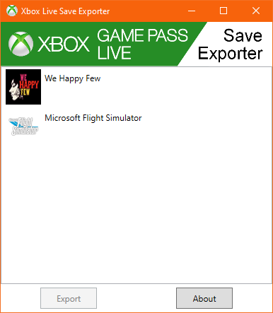
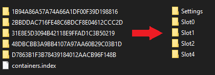

# Xbox-Live-Save-Exporter
Export your save files from your Xbox Live or Game Pass games, then manually upload them to Steam or another platform.

<!--[Website](https://tom60chat.wixsite.com/katycorp/post/?lang=en)-->

## Features
- Lists all your games that are compatible with Xbox Live Cloud.
- Export your saved game files to a folder of your choice
- Rename your files to their readable name

## Download
Only works on Windows 10 version 1507 (build 10240) or newer

- [Download](https://github.com/Tom60chat/Xbox-Live-Save-Exporter/releases/tag/release) the zip file.
- Open Game Pass Save Tranfer.exe
- Done.

## Screenshots

