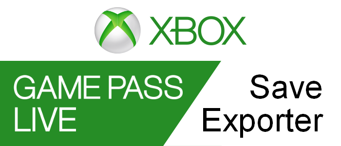

# Xbox-Live-Save-Exporter
Export your local save files from your Xbox Live or Game Pass games, then manually upload them to Steam or another platform.

  

<!--[Website](https://tom60chat.wixsite.com/katycorp/post/?lang=en)-->

## Features
- Lists all your local games that are compatible with Xbox Live Cloud.
- Export your local saved game files to a folder of your choice
- Rename your files to their readable name

## Download
Only works on Windows 10 version 1507 (build 10240) or newer

| UWP (Easy) | WPF | 
| ---------- | --- |
|  | <ul><li>[Download](https://github.com/Tom60chat/Xbox-Live-Save-Exporter/releases/tag/release) the zip file.</li><li>Open Game Pass Save Tranfer.exevalue 2</li><li>Done.</li></ul>|

## Screenshots

  

  

## Thanks to
- [HunterStanton](https://github.com/HunterStanton/ContainerReader)
- [snoozbuster](https://github.com/goatfungus/NMSSaveEditor/issues/306)

Thanks to them, most of the work was done, making it easier for me to develop the application
