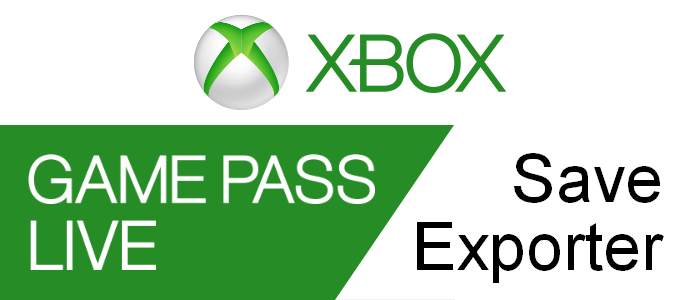

# Xbox Game Save Exporter
Export save files from your Xbox games to a folder. Works with Game Pass and cloud-compatible games. Manually transfer your local saves to Steam or other platforms.

  

## Features
- List all your local games that are compatible with Xbox Live Cloud.
- Export your local saved game files to a folder of your choice.
- Rename your files to their readable names.

## Download
Only works on Windows 10 version 1607 (build 14393) and newer (including Windows 11)

| Microsoft Store (Easy) | Portable | 
| ---------- | --- |
|  | <ul><li>[Download](https://github.com/Tom60chat/Xbox-Live-Save-Exporter/releases) the zip file.</li><li>Open Xbox Live Save Exporter.exe</li><li>Done.</li></ul>|

## Screenshots

  

  

## Thanks to
- [HunterStanton](https://github.com/HunterStanton/ContainerReader)
- [snoozbuster](https://github.com/goatfungus/NMSSaveEditor/issues/306)

Thanks to their foundational work, developing this application was made significantly easier.
